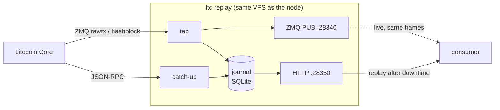

# ltc-replay

A durable tap and replay service for a Litecoin Core node.

Core's ZMQ is fire-and-forget. It publishes `rawtx` and `hashblock` to whoever
happens to be connected, and buffers nothing for anyone who isn't. A consumer
that restarts — a deploy, a crash, an OOM kill — never learns about the frames
published while it was away. If those frames were deposits, the money is on
chain and nothing in the consuming system knows to look for it.

This service runs on the node VPS, journals every frame before re-publishing
it, and lets a consumer ask for what it missed.



The tap covers consumer downtime. Catch-up covers the relay's *own* downtime
by asking the node what the chain looks like and filling any gap — so a VPS
reboot is also survivable.

## What it guarantees

**Every block is recoverable.** Block records are permanent and are written by
whichever of the two paths sees them first. A consumer that knows the last
height it processed can always stream the rest.

**Reorgs are announced.** If the block journalled at a height is no longer the
block the node has there, the orphaned branch is recorded as a `reorg` event
and the journal re-walks. A consumer that credited money against the orphaned
branch can find out.

**Core-side drops are visible.** Core stamps each frame with a per-topic
sequence counter. A skip means Core's high-water mark discarded frames, which
is otherwise completely silent. The relay logs it and counts it in `/v1/stats`.

### What it does not guarantee

Raw mempool sightings are retention-bounded (`TX_RETENTION_HOURS`, 72h by
default). They're a latency optimisation, not the source of truth — a deposit
missed in the mempool is still recovered from its block. Only blocks are kept
forever.

The relay is a single process against a single node. It is not a substitute for
the node being up, and it does not replicate anything.

## Requirements

- Node.js ≥ 20
- Litecoin Core with **`txindex=1`** and ZMQ enabled — see
  [`deploy/litecoin.conf.snippet`](deploy/litecoin.conf.snippet)

`txindex` is not optional. Replay resolves transactions belonging to no loaded
wallet, which Core only serves from the transaction index. The service checks
at boot and refuses to start without it rather than serving an incomplete
history.

## Install

```bash
git clone <this repo> /opt/ltc-replay
cd /opt/ltc-replay
npm ci
npm run build

cp .env.example .env
node -e "console.log(require('crypto').randomBytes(32).toString('hex'))"  # AUTH_TOKEN
$EDITOR .env

sudo useradd --system --home /opt/ltc-replay --shell /usr/sbin/nologin ltcreplay
sudo mkdir -p /opt/ltc-replay/data
sudo chown -R ltcreplay:ltcreplay /opt/ltc-replay
sudo chmod 600 /opt/ltc-replay/.env

sudo cp deploy/ltc-replay.service /etc/systemd/system/
sudo systemctl daemon-reload
sudo systemctl enable --now ltc-replay
journalctl -u ltc-replay -f
```

Both native dependencies (`zeromq`, `better-sqlite3`) ship prebuilt binaries for
linux-x64. If `npm ci` tries to compile, install a toolchain first:
`apt install -y build-essential python3`.

### Exposure

`HTTP_BIND` and `PUB_BIND` both default to loopback, so a half-finished deploy
is unreachable rather than open. To serve a consumer on another host, bind to a
private interface and firewall both ports to that host:

```bash
ufw allow from <consumer-ip> to any port 28350 proto tcp
ufw allow from <consumer-ip> to any port 28340 proto tcp
```

The bearer token is the only authentication on the HTTP API, and **ZMQ PUB has
none at all** — anyone who can reach `PUB_BIND` reads every transaction the tap
sees. A WireGuard tunnel between the two hosts is the better arrangement; put
TLS in front of the HTTP port if it crosses anything public.

## API

Everything except `/health` needs `Authorization: Bearer <AUTH_TOKEN>`.

| Endpoint | Purpose |
|---|---|
| `GET /health` | Liveness. Unauthenticated, reveals nothing about the chain. |
| `GET /v1/tip` | Journal cursor, node height, and `lagBlocks` between them. |
| `GET /v1/events?since=&limit=` | Cursor-based journal read, blocks and mempool txs interleaved. |
| `GET /v1/replay?sinceHeight=&maxBlocks=` | NDJSON stream of blocks with full raw transactions. |
| `GET /v1/block/<hash>` | One block with its transactions. |
| `GET /v1/stats` | Journal counts, tap counters, Core-drop count. |

`/v1/replay` terminates its stream with `{"done":true,"nextHeight":…,"hasMore":…}`.
That line is load-bearing: without it a truncated response is indistinguishable
from "you are up to date", and a consumer would skip blocks it never received.
The bundled client throws if it's absent.

```bash
curl -H "Authorization: Bearer $AUTH_TOKEN" localhost:28350/v1/tip
curl -H "Authorization: Bearer $AUTH_TOKEN" \
  "localhost:28350/v1/replay?sinceHeight=2700000&maxBlocks=5"
```

## Using it from a consumer

**Live path — no code change.** Point the existing Core ZMQ subscriber at the
relay instead of the node. Same topics, same frames:

```
LTC_ZMQ_TX_URL=tcp://<relay-host>:28340
LTC_ZMQ_BLOCK_URL=tcp://<relay-host>:28340
```

**Catch-up path.** Copy [`client/ltc-replay-client.ts`](client/ltc-replay-client.ts)
into the consuming service — it has no dependencies — and run it at boot:

```ts
const client = new LtcReplayClient({ baseUrl, token });

const saved = await redis.get("ltc:replay:height");
const cursor = saved ? Number(saved) : (await client.tip()).node.height ?? 0;

for await (const block of client.replayBlocks(cursor)) {
  for (const tx of block.txs) await handleRawTx(tx.hex);
  await redis.set("ltc:replay:height", String(block.height));
}
```

Persist the height inside the loop, not after it. An interrupted catch-up then
resumes from the last block it actually finished, and re-processing one block
is harmless as long as credits are keyed on `txid:vout`.

Also handle `reorg` events from `/v1/events` if the consumer credits before
deep confirmation — that's the only signal that a previously reported block is
gone.

## Operations

```bash
systemctl status ltc-replay
journalctl -u ltc-replay -f
curl -sH "Authorization: Bearer $AUTH_TOKEN" localhost:28350/v1/stats | jq
```

**`lagBlocks` above zero** means catch-up hasn't finished. Normal briefly after
a restart; sustained means the node is slow or unreachable.

**`coreGaps` climbing** means Core's ZMQ high-water mark is dropping frames.
Raise `zmqpubrawtxhwm`. Blocks are unaffected — catch-up covers those — but
mempool sightings are being lost.

**Disk.** Blocks are a few dozen bytes each (~576/day). Mempool transactions
dominate and are pruned every 15 minutes on `TX_RETENTION_HOURS`. Expect a few
hundred MB at the default 72 hours; lower it if disk is tight.

**The journal is disposable.** Delete it and restart: catch-up rebuilds block
history from the node. Only mempool sightings inside the retention window are
lost, and those are recoverable from blocks anyway.

## Layout

```
src/config.ts     env loading and hard validation
src/rpc.ts        Litecoin Core JSON-RPC, read methods only
src/journal.ts    SQLite event log, cursor semantics, retention
src/txid.ts       txid from a raw serialisation (strips witness data)
src/tap.ts        ZMQ subscribe → journal → republish
src/catchup.ts    gap filling and reorg reconciliation
src/http.ts       the replay API
src/index.ts      boot order, shutdown
client/           dependency-free consumer client
deploy/           systemd unit, litecoin.conf snippet
```

## Licence

Unlicensed / private.
