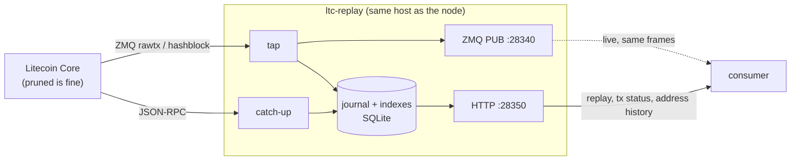

# ltc-replay

**Litecoin Core's ZMQ forgets. This remembers.**

[](https://github.com/SwapzyCC/ltc-replay/actions/workflows/ci.yml)
[](https://github.com/SwapzyCC/ltc-replay/actions/workflows/codeql.yml)
[](LICENSE)
[](package.json)
[](docs/pruned-nodes.md)

A durable tap and replay service for a Litecoin Core node — including a
**pruned** one.

Core's ZMQ is fire-and-forget. It publishes `rawtx` and `hashblock` to whoever
happens to be connected, and buffers nothing for anyone who isn't. A consumer
that restarts — a deploy, a crash, an OOM kill — never learns about the frames
published while it was away. If those frames were deposits, the money is on
chain and nothing in the consuming system knows to look for it.

This service runs on the node's own host, journals every frame before
re-publishing it, and lets a consumer ask for what it missed. It also keeps the
two indexes a pruned node cannot keep for itself, so "did this deposit confirm?"
has an answer.

It stores only what you asked for. Register your addresses with
`POST /v1/watch` and every other transaction on the chain is decoded, counted
and dropped — which is the difference between a database sized by your deposits
and one sized by Litecoin.



The tap covers consumer downtime. Catch-up covers the relay's _own_ downtime by
asking the node what the chain looks like and filling any gap — so a host reboot
is survivable too.

## The problem it actually solves

Two problems, and the second is the one that bites hardest in production.

**1. Nobody is listening.** Covered above: ZMQ buffers nothing for a
disconnected subscriber.

**2. The node cannot answer about a confirmed deposit.** `prune` and `txindex`
are mutually exclusive in Core — a node configured with both refuses to start:

```
Error: Prune mode is incompatible with -txindex.
```

Without `txindex`, `getrawtransaction` answers only from the mempool for a
transaction belonging to no loaded wallet. So the moment a watch-only deposit is
mined — the exact moment it becomes final — the node starts answering:

```
-5: No such mempool transaction. Use -txindex or provide a block hash.
```

The relay closes that by indexing what it sees on the way past: a
txid → block index bounded by `TX_INDEX_BLOCKS`, and an address → received-output
index. `GET /v1/tx/:txid` and `GET /v1/address/:address` answer from those.

See [docs/pruned-nodes.md](docs/pruned-nodes.md) — it is five minutes and it
determines whether the rest of your deposit plan is possible.

## What it guarantees

**Every block is recoverable.** Block records are permanent and are written by
whichever of the two paths sees them first. A consumer that knows the last
height it processed can always stream the rest.

**Reorgs are announced.** If the block journalled at a height is no longer the
block the node has there, the orphaned branch is recorded as a `reorg` event and
the journal re-walks. A consumer that credited money against the orphaned branch
can find out.

**Core-side drops are visible.** Core stamps each frame with a per-topic
sequence counter. A skip means Core's high-water mark discarded frames, which is
otherwise completely silent. The relay logs it and counts it in `/v1/stats`.

**Absence is auditable.** Every lookup reports the range it can speak for
(`indexedFrom`/`indexedTo`, `coverage.lagBlocks`). "I have no record of it" and
"it did not happen" are different answers, and a consumer that cannot tell them
apart eventually drops a real deposit.

### What it does not guarantee

Raw mempool sightings are retention-bounded (`TX_RETENTION_HOURS`, 72h by
default). They are a latency optimisation, not the source of truth — a deposit
missed in the mempool is still recovered from its block. Only blocks are kept
forever.

The relay is a single process against a single node. It is not a substitute for
the node being up, and it replicates nothing.

## Requirements

- Node.js ≥ 22
- Litecoin Core with ZMQ enabled — see
  [`deploy/litecoin.conf.snippet`](deploy/litecoin.conf.snippet)

`txindex` is **not** required, and on a pruned node it is not even possible.
Preflight reports what the node can and cannot serve, then the relay maintains
its own indexes to cover the difference. It refuses to start only if the node is
still in initial block download, because a syncing node would have it publish a
tip that is not the chain tip.

## Quick start

```bash
git clone https://github.com/SwapzyCC/ltc-replay.git /opt/ltc-replay && cd /opt/ltc-replay
npm ci && npm run build

cp .env.example .env
node -e "console.log(require('crypto').randomBytes(32).toString('hex'))"  # AUTH_TOKEN
$EDITOR .env

sudo cp deploy/ltc-replay.service /etc/systemd/system/
sudo systemctl daemon-reload && sudo systemctl enable --now ltc-replay
journalctl -u ltc-replay -f
```

Or with Docker:

```bash
cp .env.example .env && $EDITOR .env
docker compose up -d --build
```

Or pull the published image instead of building it, from
[GHCR](https://github.com/SwapzyCC/ltc-replay/pkgs/container/ltc-replay):

```bash
docker pull ghcr.io/swapzycc/ltc-replay:1
```

To run it with the compose file, replace the `build:` block and the
`image:` line with `image: ghcr.io/swapzycc/ltc-replay:1`, then
`docker compose up -d`. Every version tag publishes amd64 and arm64
images, tagged with the full version, `major.minor`, `major` and `latest`.

Full instructions, including the user/permissions setup and the two Docker
network shapes, are in [docs/deployment.md](docs/deployment.md).

> The single most common misconfiguration: `LTC_ZMQ_TX_URL` pointed at Core's
> **`hashtx`** publisher instead of **`rawtx`**. They are different topics on
> different ports. Subscribing to the wrong one delivers 32-byte hashes where
> the tap expects transactions — it decodes nothing, indexes nothing, and looks
> perfectly healthy. If `tap.txSeen` in `/v1/stats` stays at zero, that is why.

## API

Everything except `/health` needs `Authorization: Bearer <AUTH_TOKEN>`.

| Endpoint                                 | Purpose                                                        |
| ---------------------------------------- | -------------------------------------------------------------- |
| `GET /health`                            | Liveness. Unauthenticated, reveals nothing about the chain.    |
| `GET /v1/tip`                            | Journal cursor, node height, and `lagBlocks` between them.     |
| `GET /v1/events?since=&limit=`           | Cursor-based journal read; blocks, txs and reorgs interleaved. |
| `GET /v1/replay?sinceHeight=&maxBlocks=` | NDJSON stream of blocks with full raw transactions.            |
| `GET /v1/block/<hash>`                   | One block with its transactions.                               |
| `GET /v1/tx/<txid>`                      | Confirmation status. Replaces `getrawtransaction`.             |
| `GET /v1/address/<address>`              | Payments to an address, split confirmed / unconfirmed.         |
| `GET /v1/stats`                          | Journal counts, tap counters, Core-drop count.                 |
| `GET /v1/watch`                          | The addresses being indexed. `?limit=0` returns just a count.  |
| `POST /v1/watch`                         | Register addresses to index. Idempotent, bulk.                 |
| `DELETE /v1/watch/<address>`             | Stop watching one address. Its history is kept.                |

```bash
curl -sH "Authorization: Bearer $AUTH_TOKEN" localhost:28350/v1/tip
curl -sH "Authorization: Bearer $AUTH_TOKEN" localhost:28350/v1/tx/$TXID
curl -sH "Authorization: Bearer $AUTH_TOKEN" \
  "localhost:28350/v1/address/$ADDR?minConfirmations=6"

# Nothing is indexed until an address is registered.
curl -sH "Authorization: Bearer $AUTH_TOKEN" -H 'content-type: application/json' \
  -d "{\"addresses\":[\"$ADDR\"]}" localhost:28350/v1/watch
```

`/v1/replay` terminates its stream with `{"done":true,"nextHeight":…,"hasMore":…}`.
That line is load-bearing: without it a truncated response is indistinguishable
from "you are up to date", and a consumer would skip blocks it never received.
The bundled client throws if it is absent.

Full request and response shapes: [docs/api.md](docs/api.md).

## Using it from a consumer

[`client/ltc-replay-client.ts`](client/ltc-replay-client.ts) is a
dependency-free TypeScript client — copy the file into the consuming service.

**Live path — no code change.** Point the existing Core ZMQ subscriber at the
relay instead of the node. Same topics, same frames, byte for byte:

```
LTC_ZMQ_TX_URL=tcp://<relay-host>:28340
LTC_ZMQ_BLOCK_URL=tcp://<relay-host>:28340
```

**Gap recovery at boot.** This is what covers the deploy, the crash and the OOM
kill:

```ts
const client = new LtcReplayClient({ baseUrl, token });

const saved = await store.get("ltc:replay:height");
const cursor = saved ? Number(saved) : ((await client.tip()).node.height ?? 0);

for await (const block of client.replayBlocks(cursor)) {
  for (const tx of block.txs) await handleRawTx(tx.hex);
  await store.set("ltc:replay:height", String(block.height)); // inside the loop
}
```

Persist the height inside the loop, not after it. An interrupted catch-up then
resumes from the last block it actually finished, and re-processing one block is
harmless as long as credits are keyed on `(txid, vout)` — which they must be
anyway.

**Register the addresses.** Nothing is indexed until you do. Push each address
as it is derived — before it is shown to anyone — and re-push the whole set at
boot, because the watchlist is the one part of the relay's database that cannot
be rebuilt from the chain:

```ts
await client.watch([address]); // when derived
await client.syncWatched(allKnownAddresses); // at boot, and on a timer
```

`syncWatched` compares counts first, so the periodic call is one small GET
until the relay has actually been rebuilt.

**Confirmation status.** Replace `getrawtransaction` with `client.txStatus(txid)`
and `client.addressHistory(address, { minConfirmations: 6 })`. Both report the
range they can speak for, so an empty answer is interpretable.

The failure modes worth understanding before you wire this up are in
[docs/integration.md](docs/integration.md).

## Documentation

| Document                                 | Read it when                                       |
| ---------------------------------------- | -------------------------------------------------- |
| [Pruned nodes](docs/pruned-nodes.md)     | Before anything else, if your node is pruned.      |
| [Architecture](docs/architecture.md)     | You want to know how it works inside.              |
| [Configuration](docs/configuration.md)   | Filling in `.env`.                                 |
| [Deployment](docs/deployment.md)         | Installing it on the node host.                    |
| [API reference](docs/api.md)             | Writing a consumer.                                |
| [Integration guide](docs/integration.md) | Wiring a wallet backend or deposit monitor.        |
| [Operations](docs/operations.md)         | It is running and you need to keep it that way.    |
| [TLS endpoints](docs/tls-endpoints.md)   | The node is behind TLS, or the relay runs off-box. |

## Layout

```
src/config/     env loading, parsing, hard validation
src/core/       logging, error types
src/chain/      RPC client, txid derivation, address decoding, units
src/journal/    SQLite journal and indexes; SQL lives in .sql files
src/services/   tap (ZMQ -> journal -> republish) and catch-up
src/http/       router, auth, responses, one file per route
src/app.ts      boot order and shutdown
client/         dependency-free consumer client
deploy/         systemd unit, litecoin.conf snippet
docs/           the documents linked above
test/           node:test, no framework
```

## Development

```bash
npm run dev          # tsx watch
npm run check        # lint + typecheck + test
npm run build        # tsc + copy *.sql into dist/
npm run format
```

Lint is [oxlint](https://oxc.rs) rather than ESLint: typescript-eslint has no
peer support for TypeScript 7 yet, and oxlint runs the same rule set in a
fraction of the time.

The named statements in `src/journal/sql/queries.sql` are validated against the
code in both directions at boot — a statement in the file with no caller, or a
caller with no statement, is a startup failure rather than a route that throws
later.

## Contributing

Bug reports, docs fixes and patches are welcome. [CONTRIBUTING.md](CONTRIBUTING.md)
covers the setup (`npm ci && npm run check` — no node, no network, no database
needed) and the few conventions that are not obvious from the code: SQL lives in
`.sql` files and is validated in both directions at boot, security paths never
fall back silently, and a money-correctness fix needs a test that fails without
it.

Participation is governed by the [Code of Conduct](CODE_OF_CONDUCT.md).

## Security

This service holds a node's RPC credentials and answers the question a wallet
backend uses to decide whether to credit someone money. Vulnerabilities go
through GitHub's private reporting, never a public issue —
[SECURITY.md](SECURITY.md) has the scope, the non-scope, and what to include.

## Licence

[BSD 3-Clause](LICENSE). Use it, fork it, ship it; keep the notice, and do not
use the author's name to endorse what you build with it.
