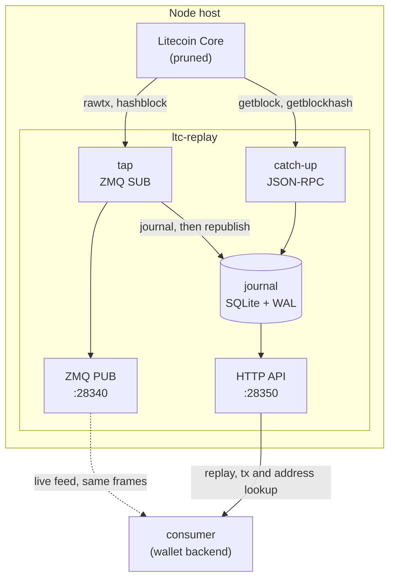
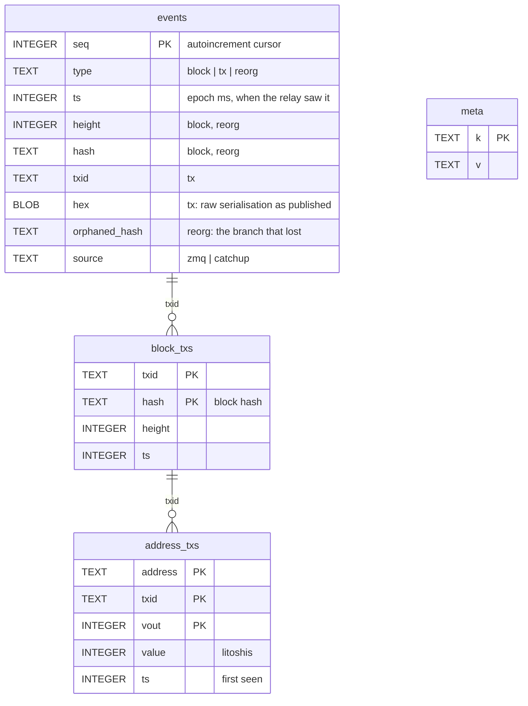

# Architecture

## The problem this exists for

Litecoin Core's ZMQ publishers are fire-and-forget. Core pushes `rawtx` and
`hashblock` frames to whoever happens to be connected at that instant and
buffers nothing for anyone who is not. There is no acknowledgement, no cursor,
and no way to ask for a frame again.

For a wallet backend that means a deploy, a crash, an OOM kill or a network
blip is a window in which deposits arrive on chain and nothing in the consuming
system ever hears about them. The money is real; the notification is gone.

Core's high-water mark is the second, quieter version of the same problem. When
a topic's queue fills, Core drops frames silently — no error, no log on the
consumer's side, just an absence.

`ltc-replay` closes both by putting a durable journal between Core and the
consumer, on the same host as the node.

## The whole picture



Two ingest paths, one journal, two egress paths. Everything below follows from
that shape.

## The two ingest paths

They cover different failures, which is why both exist.

|           | tap (ZMQ)                       | catch-up (JSON-RPC)                        |
| --------- | ------------------------------- | ------------------------------------------ |
| Covers    | Consumer downtime               | The relay's _own_ downtime                 |
| Latency   | Immediate                       | Up to `CATCHUP_INTERVAL_MS`, or on a block |
| Sees      | Mempool transactions and blocks | Confirmed blocks only                      |
| Retention | `TX_RETENTION_HOURS`            | Permanent for block records                |

The tap subscribes to `rawtx` and `hashblock`, writes each frame to the journal
**before** re-publishing it, and derives the txid itself. Catch-up asks the node
what the chain looks like and fills whatever the journal is missing — so a VPS
reboot is survivable too, not just a consumer restart.

They overlap deliberately at startup. The tap subscribes _before_ catch-up
runs, so nothing published during the catch-up window is lost. The journal
deduplicates the overlap; a gap would not be recoverable.

### txid, not wtxid

Core's `rawtx` topic publishes the **witness** serialisation. Hashing it
directly gives the wtxid, not the txid — the identifier everything else in the
ecosystem uses. `chain/tx.ts` re-serialises without the marker, flag and
witness stack before hashing. Getting this wrong produces identifiers that look
entirely valid and match nothing.

### Address decoding

`chain/payments.ts` decodes each output's script to an address: P2PKH, P2SH
(both Litecoin's `0x32` and the legacy `0x05`), and segwit v0/v1+ with the
right checksum constant for each — bech32 for v0, bech32m for v1 and above.
Scripts with no address form, `OP_RETURN` among them, are skipped rather than
given a placeholder.

The same function runs on both ingest paths. That is what makes a mempool
sighting and its later confirmation the same row.

## The journal

SQLite, WAL mode, `synchronous=NORMAL`. One file, no server, no network hop
between the writer and its storage.



`events` is an append-only log with a monotonic `seq` — the cursor consumers
read from. `block_txs` and `address_txs` are the indexes described in
[Pruned nodes](pruned-nodes.md); both are `WITHOUT ROWID`, because both are
composite-key lookup tables where SQLite's implicit rowid is pure overhead.

Note that `address_txs` holds no height of its own. A payment's confirmation
state comes from joining it to `block_txs` on `txid`, which is exactly why a
mempool sighting turns into a confirmed one without the row being rewritten:
the join simply starts matching. `block_txs` is keyed `(txid, hash)` rather
than `(txid, height)` so a reorg's competing blocks are distinct rows rather
than a conflict.

Two partial unique indexes handle deduplication on `events`, so the tap and
catch-up writing the same block is a no-op rather than a duplicate.

### Retention

| Data                   | Kept                               |
| ---------------------- | ---------------------------------- |
| Block events           | Forever — a few dozen bytes each   |
| Mempool `tx` events    | `TX_RETENTION_HOURS` (72h default) |
| `block_txs`            | `TX_INDEX_BLOCKS` below the tip    |
| `address_txs`, unmined | `TX_RETENTION_HOURS`               |
| `address_txs`, mined   | Ages out with the block index      |

Pruning runs every 15 minutes and checkpoints the WAL when it removes anything.
It is housekeeping: a failure is logged and never takes the service down.

### Amounts

Every amount crosses the API as an **integer litoshi string** and is held as a
`bigint` in TypeScript. The LTC form is supplied alongside, formatted to 8
decimal places, for display only. No amount ever passes through a JavaScript
`number`.

## Reorgs

If the block the journal recorded at some height is no longer the block the
node has there, catch-up records a `reorg` event naming the orphaned hash and
re-walks from the fork point. It searches up to 100 blocks deep before giving
up and logging loudly.

This is the only signal a consumer gets that a block it credited against is
gone. A consumer crediting before deep confirmation must handle it.

## Boot and shutdown order

`app.ts` is the composition root — the only file that knows what is built, in
what order, and how it comes down. Nothing below it reads `process.env` or
reaches for a singleton, which is what lets each piece be stood up in isolation
by the tests.

```
1. journal    open the store before anything can want to write to it
2. preflight  refuse to start against a node in initial block download;
              report, but tolerate, a pruned one
3. tap        subscribe BEFORE catching up, so the window is covered
4. catch-up   fill whatever the last shutdown left behind
5. serve      advertise availability only once the journal is current
```

Step 2 is the one hard stop. A node still syncing would have the relay publish
a tip that is not the chain tip, and consumers would read the absence of their
deposit as final. A pruned node is not an error — it bounds how far back replay
can reach, which is a horizon to report rather than a defect.

Step 5 matters for the same reason: a consumer's first poll must not be
answered with a false empty.

Shutdown runs the reverse and is idempotent. A second `SIGTERM` during a slow
drain is ignored rather than tearing the journal out from under a write. An
in-flight `/v1/replay` stream can legitimately run for a while, so the drain
races against a 10-second grace period.

## Source layout

```
src/
  app.ts            composition root — build order, shutdown
  index.ts          process wrapper: dotenv, config, signals

  chain/
    rpc.ts          Litecoin Core JSON-RPC, read methods only
    tx.ts           txid from a witness serialisation
    address.ts      script → address, base58check and bech32/bech32m
    payments.ts     output decoding shared by both ingest paths
    units.ts        litoshi ↔ LTC formatting, bigint throughout

  config/
    index.ts        parsing and hard validation
    env.ts          typed env readers
    dotenv.ts       .env loading, no dependency
    types.ts        the Config shape every module reads

  core/
    log.ts          levelled logging, human or JSON
    errors.ts       error shapes

  http/
    server.ts       wiring only
    router.ts       the dispatch table
    auth.ts         constant-time bearer comparison
    respond.ts      JSON, NDJSON, query-param parsing
    context.ts      ApiDeps
    routes/         one file per endpoint

  journal/
    journal.ts      the store
    types.ts        row and event shapes
    sql/
      schema.sql    DDL
      queries.sql   named statements, split on `-- name:` markers
      index.ts      loader and both-directions validation

  services/
    tap.ts          ZMQ subscribe → journal → republish
    catchup.ts      gap filling, reorg detection, index maintenance
```

### Why the SQL lives in .sql files

So the text an operator pastes into the `sqlite3` CLI is the text the service
runs. `queries.sql` is split on `-- name:` markers and validated in **both**
directions at startup: a name the journal expects but the file omits, and a
query the file defines that nothing prepares, are each a boot failure. The
alternative is a route that throws the first time someone calls it in
production.

Every statement is prepared once at construction and reused, and the multi-row
writes are `db.transaction()` closures built once rather than per call.

## Security posture

- **HTTP.** One bearer token, compared with `timingSafeEqual` over SHA-256
  digests of both sides — hashing first so the comparison gets equal-length
  buffers, since comparing the raw strings would leak the real token's length.
  Only `/health` is public.
- **Route resolution happens before authentication**, so an unauthenticated
  request to a path that does not exist still answers `401`. A scan cannot map
  the API by watching for `404`s.
- **ZMQ PUB has no authentication of any kind.** Anyone who can reach
  `PUB_BIND` reads every transaction the tap sees. Both ports default to
  loopback, and the service names either one at boot if it is bound off-box.
- **Read-only against the node.** The relay calls no wallet method and no write
  method. Compromising it does not move coins.

## Related

- [Pruned nodes](pruned-nodes.md) — why the indexes exist
- [API reference](api.md) — the endpoints in detail
- [Operations](operations.md) — what to watch once it runs
