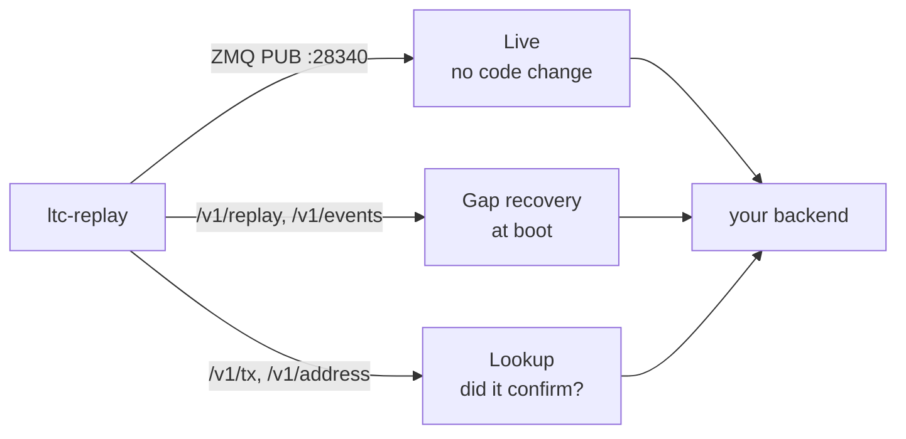

# Integration guide

How to wire a wallet backend or deposit monitor to the relay, and the failure
modes that quietly lose money if you get them wrong.

[`client/ltc-replay-client.ts`](../client/ltc-replay-client.ts) is a
dependency-free TypeScript client — copy the file into the consuming service.

## The three paths



Most integrations need all three. The live path gives latency, gap recovery
gives completeness, and the lookup endpoints give the answer that a pruned node
cannot.

---

## 1. Live path — no code change

Point the existing Core ZMQ subscriber at the relay instead of the node:

```
LTC_ZMQ_TX_URL=tcp://<relay-host>:28340
LTC_ZMQ_BLOCK_URL=tcp://<relay-host>:28340
```

Same topics, same frames, byte for byte. The relay journals each frame _before_
re-publishing it, so anything you receive is already recoverable.

Both topics come from the one socket, which is why both variables point at the
same port.

---

## 2. Gap recovery at boot

Run this every time the consumer starts. It is what covers the deploy, the
crash, and the OOM kill.

```ts
import { LtcReplayClient } from "./ltc-replay-client.js";

const client = new LtcReplayClient({ baseUrl, token });

const saved = await store.get("ltc:replay:height");
const cursor = saved ? Number(saved) : ((await client.tip()).node.height ?? 0);

for await (const block of client.replayBlocks(cursor)) {
  for (const tx of block.txs) await handleRawTx(tx.hex);
  await store.set("ltc:replay:height", String(block.height)); // inside the loop
}
```

**Persist the height inside the loop, not after it.** An interrupted catch-up
then resumes from the last block it actually finished. Re-processing one block
is harmless as long as credits are keyed on `(txid, vout)` — which they must be
anyway.

On a first run with no saved cursor, starting at the node's current tip means
you see everything from now on. Set it lower to backfill.

### Why the client throws on a missing terminator

`/v1/replay` ends its stream with `{"done":true,…}`. Without that line, a
truncated response is byte-for-byte indistinguishable from "you are up to
date", and a consumer would advance its cursor past blocks it never received —
silently, permanently, with no error anywhere. The client treats a missing
terminator as a hard failure. If you write your own client, do the same.

### Mempool sightings too

If you also want unconfirmed sightings back after downtime, read `/v1/events`
with a `seq` cursor instead. It interleaves blocks, mempool transactions and
reorgs in the order the relay saw them:

```ts
let seq = Number((await store.get("ltc:replay:seq")) ?? 0);
for (;;) {
  const page = await client.eventsSince(seq);
  for (const e of page.events) await handleEvent(e);
  seq = page.next;
  await store.set("ltc:replay:seq", String(seq));
  if (!page.hasMore) break;
}
```

Bounded by `TX_RETENTION_HOURS` for `tx` events. Block events are permanent.

---

## 3. Confirmation status — replacing `getrawtransaction`

Against a pruned node, `getrawtransaction` **cannot** answer for a confirmed
watch-only deposit. It returns `-5: No such mempool transaction` at precisely
the moment the deposit becomes final. See [Pruned nodes](pruned-nodes.md).

Replace it:

```ts
const st = await client.txStatus(txid);

switch (st.status) {
  case "mined":
    if ((st.confirmations ?? 0) >= REQUIRED_CONFIRMATIONS) await credit(txid);
    break;

  case "mempool":
    break; // keep waiting

  case "unknown":
    // NOT the same as "did not happen".
    if (st.indexedFrom !== null && expectedHeight < st.indexedFrom) {
      throw new Error(`height ${expectedHeight} is below the relay's index floor`);
    }
    break;
}
```

Two distinctions the code above depends on:

- `confirmations: null` means **the node was unreachable** — an unknown.
  `confirmations: 0` on a `mempool` result means **zero confirmations** — a
  fact. Collapsing them with `?? 0` in the wrong place turns "I could not check"
  into "definitely not confirmed", which is how a stuck deposit becomes an
  abandoned one.
- `unknown` is a negative answer only **within** `indexedFrom..indexedTo`.
  Outside that range you have been told nothing.

---

## 4. Address monitoring — the direct route

One request answers "has this address been paid, by what, and is it final yet":

```ts
const h = await client.addressHistory(address, { minConfirmations: 6 });

if (h.coverage.lagBlocks !== 0) return; // relay is behind; ask again later
if (h.truncated) {
  /* raise limit before trusting totals */
}

for (const e of h.confirmed) {
  await creditOnce(e.txid, e.vout, BigInt(e.valueSat));
}
for (const e of h.unconfirmed) {
  await markPending(e.txid, e.vout, BigInt(e.valueSat), e.confirmations);
}
```

`minConfirmations` moves the line between the two lists. The relay has no
finality policy of its own — it reports `confirmations` on every entry and
splits wherever you say.

### Five things to get right

**Key credits on `(txid, vout)`.** The same entry is returned on every poll,
and returns once more with a block attached when it confirms. The index is
keyed `(address, txid, vout)` and both ingest paths use the same decoder, so a
mempool sighting and its later mining are one entry gaining a block — never
two. Your credit ledger has to be idempotent on that key.

**Parse amounts with `BigInt`.** `valueSat` is an integer litoshi string.
`valueLtc` is a formatted string for display. Neither should ever go through
`Number` — 21 million LTC in litoshis is well inside `Number.MAX_SAFE_INTEGER`,
but the habit of parsing money as a float is how rounding errors get in.

**Check `coverage` before trusting an empty list.** An empty result with
`lagBlocks: 400` is not evidence of anything. One with
`addressIndexEnabled: false` means the index was never being written at all.

**Check `truncated`.** When true, `totals` describe the returned page rather
than the address. Raise `limit` before reconciling a balance from them.

**Only received outputs are indexed.** Resolving an input's address needs the
transaction it spends, which a pruned node may no longer hold. "What did this
address receive" is the deposit-monitor question, so this costs you nothing —
but do not expect a spend history.

---

## 5. Reorgs

A `reorg` event on `/v1/events` is the only signal that a block you already
credited against is gone:

```json
{ "seq": 918500, "type": "reorg", "ts": 1756…,
  "height": 2751380, "hash": "<the winner>", "orphanedHash": "<the loser>" }
```

If you credit before deep confirmation, handle it: find what you credited from
`orphanedHash` and reverse or re-verify it. If you only credit at six
confirmations, a reorg that deep is rare enough to alert a human about rather
than automate against.

---

## Recommended polling shape

| Question                         | Endpoint                     | Frequency                        |
| -------------------------------- | ---------------------------- | -------------------------------- |
| Is the relay healthy?            | `/health`                    | Your uptime probe                |
| Is the relay caught up?          | `/v1/tip`                    | Before acting on an empty answer |
| Did anything happen at all?      | ZMQ live feed                | Continuous                       |
| What did I miss?                 | `/v1/replay` or `/v1/events` | Once at boot                     |
| Did this deposit confirm?        | `/v1/tx/:txid`               | Per pending deposit              |
| Everything paid to this address? | `/v1/address/:address`       | On demand, or reconciliation     |

Do not poll `/v1/address` for every watched address on a timer. The live feed
already tells you when something happened; use the address endpoint to answer
about one address, or to reconcile.

## Related

- [API reference](api.md) — full request and response shapes
- [Pruned nodes](pruned-nodes.md) — why `/v1/tx` exists
- [Operations](operations.md) — what to alert on
