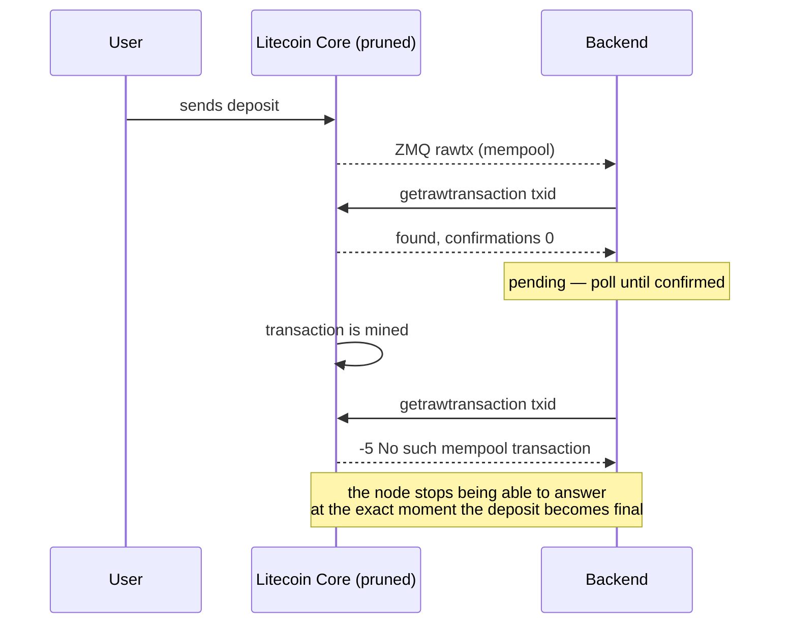

# Pruned nodes

If your node runs with `prune=`, read this before deploying anything. It is the
single constraint that shaped this service, and it is not obvious until it
costs you a deposit.

## The rule

`prune` and `txindex` are mutually exclusive in Litecoin Core. A node started
with both refuses to start:

```
Error: Prune mode is incompatible with -txindex.
```

There is no flag that reconciles them, no partial index, and no reindex that
produces one. Pruning discards block data below a floor; `txindex` is an index
over exactly that data.

## Why it matters

Without `txindex`, `getrawtransaction <txid>` can only answer for transactions
that are **in the mempool** or **owned by a loaded wallet**. For a confirmed
payment to a watch-only address — which is what a deposit to a user's derived
address is — it returns:

```
-5: No such mempool transaction. Use -txindex and provide a blockhash
    to enable blockchain transaction queries.
```

Follow the sequence through:



The transaction is _more_ certain than it was a minute ago, and the node has
become _less_ able to talk about it. A backend that reads "not found" as "not
real" discards the deposit precisely when it should be crediting it. The money
is on chain and nothing in the consuming system knows to look for it.

This is not a hypothetical class of bug. It is the default behaviour of any
straightforward `getrawtransaction`-based confirmation poller against a pruned
node.

## What ltc-replay does instead

It keeps the index Core will not.

As catch-up walks each block, it records:

- **`block_txs`** — every txid in that block, mapped to height and hash. This
  is a bounded `txindex`: `TX_INDEX_BLOCKS` deep instead of the whole chain.
- **`address_txs`** — every output the block paid, decoded to an address, keyed
  `(address, txid, vout)`.

Two endpoints serve them:

| Endpoint                   | Replaces                                       |
| -------------------------- | ---------------------------------------------- |
| `GET /v1/tx/:txid`         | `getrawtransaction` for confirmation status    |
| `GET /v1/address/:address` | An address index the node does not have at all |

The address index is keyed on `(address, txid, vout)`, and the same decoder
runs on both the ZMQ path and the block path. So a payment first seen in the
mempool and later mined is the _same row_ gaining a block — it is never counted
twice, and the transition from unconfirmed to confirmed needs no correlation
work on the consumer's side.

## The horizon, and why every answer states it

The relay can only index blocks it can read. Two floors apply:

- **The node's prune floor.** `getblockchaininfo` reports it as `pruneheight`.
  Blocks below it are gone from disk; nothing on this host can walk them.
- **The relay's own floor.** It indexes from the height it first ran, or from
  `START_HEIGHT`, and trims below `TX_INDEX_BLOCKS`.

So "I have no record of this transaction" has two very different meanings, and
a consumer that cannot tell them apart will eventually treat a real payment as
a non-event. Every answer from `/v1/tx` and `/v1/address` therefore carries the
range it can speak for:

```json
{
  "txid": "…",
  "status": "unknown",
  "indexedFrom": 2731400,
  "indexedTo": 2751402
}
```

`unknown` is a negative answer **within** that range and nothing more. If the
height you care about is below `indexedFrom`, you have been told nothing —
treat it as an error condition, not as a denial.

`/v1/address` says the same thing at more length under `coverage`:

```json
"coverage": {
  "addressIndexEnabled": true,
  "indexedFrom": 2731400,
  "indexedTo": 2751402,
  "nodeHeight": 2751402,
  "lagBlocks": 0
}
```

An empty list with `lagBlocks: 400` is not the same claim as an empty list with
`lagBlocks: 0`. Check it before concluding an address was never paid.

## Sizing the index

`TX_INDEX_BLOCKS` should comfortably exceed the longest gap you would ever want
to answer for — including a user disputing a deposit weeks after the fact.

At Litecoin's 2.5-minute target spacing:

| `TX_INDEX_BLOCKS` | Roughly    |
| ----------------- | ---------- |
| 5760              | 10 days    |
| 20000 (default)   | 5 weeks    |
| 60000             | 3.5 months |

Cost is one row per transaction per block, plus one row per decoded output when
`ADDRESS_INDEX=true`. The default lands in the hundreds of megabytes on
mainnet. Check the real number against your own node with `/v1/stats`, which
reports `indexedTxs`, `indexedOutputs` and `sizeBytes`.

Setting `TX_INDEX_BLOCKS=0` on a node without `txindex` means _nothing_ can
answer whether a transaction confirmed. The service logs a warning at boot and
starts anyway, because that is a legitimate configuration for a deployment that
only uses the live path — but it is worth being deliberate about.

## What to change in litecoin.conf

Nothing, as far as pruning goes. Do **not** add `txindex=1` and do not reindex.
See [`deploy/litecoin.conf.snippet`](../deploy/litecoin.conf.snippet) for the
ZMQ and RPC settings the relay does need, and [Deployment](deployment.md) for
the walkthrough.

## Related

- [Architecture](architecture.md) — how catch-up builds these indexes
- [API reference](api.md) — the full shape of `/v1/tx` and `/v1/address`
- [Integration guide](integration.md) — using them from a deposit monitor
